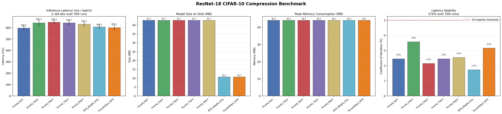
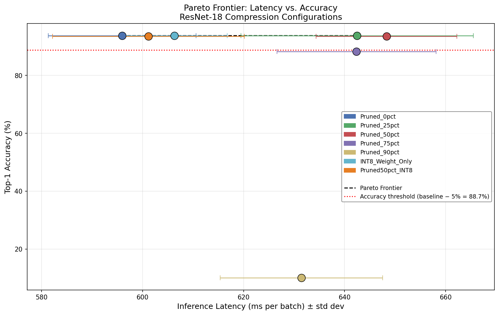

# ResNet-18 CIFAR-10 Compression Benchmark

A systematic benchmarking study of post-training model compression techniques —
unstructured magnitude pruning and INT8 weight-only quantization — applied to
ResNet-18 on CIFAR-10. Measures inference latency, model size, peak memory, and
top-1 accuracy across 7 configurations with statistically stable measurements
(500 forward passes per configuration).

---

## Table of Contents

- [Overview](#overview)
- [Project Structure](#project-structure)
- [Environment Setup](#environment-setup)
- [Running the Experiment](#running-the-experiment)
- [Results](#results)
- [Charts](#charts)
- [Key Findings](#key-findings)


---

## Overview

This project evaluates three compression strategies on a ResNet-18 model
trained on CIFAR-10:

- **Unstructured Magnitude Pruning** — L1-norm based weight zeroing at 5
  sparsity levels (0%, 25%, 50%, 75%, 90%)
- **INT8 Weight-Only Quantization** — Per-output-channel symmetric INT8
  quantization of all Conv2d and Linear layers
- **Stacked (Pruning + Quantization)** — 50% pruning followed by INT8
  quantization

Each configuration is evaluated on:
| Metric | Method |
|---|---|
| Inference latency | Mean ± std over 500 forward passes (batch=128) |
| Model size | On-disk `.pth` file size (FP32) or analytical byte count (INT8) |
| Peak memory | Parameter + buffer byte footprint |
| Top-1 accuracy | Full CIFAR-10 test set (10,000 samples) |
| Latency stability | Coefficient of Variation % (CV%) |

---

## Environment Setup

### Requirements

- Python 3.10–3.13
- macOS (Apple Silicon or Intel) or Linux
- ~2GB disk space for CIFAR-10 + checkpoints

### 1. Create and activate a virtual environment

```bash
python -m venv resnet_comp_benchmark
source resnet_comp_benchmark/bin/activate      # macOS/Linux
```

### 2. Install dependencies

```bash
pip install torch torchvision
pip install torchao
pip install pandas matplotlib
```

> **Note for macOS:** PyTorch will use the `qnnpack` backend for quantization.
> This is set automatically in the code. No additional configuration required.

### 3. Verify installation

```bash
python -c "import torch; import torchao; import torchvision; print('All imports OK')"
```

### 4. Place your pre-trained checkpoint

Put your trained `resnet18_cifar10_baseline.pth` into the `checkpoints/`
directory. The checkpoint can be either:
- A raw `state_dict` (standard `torch.save(model.state_dict(), path)`)
- A full training checkpoint with keys: `model_state_dict`, `optimizer_state_dict`,
  `epoch`, `test_acc`, `test_loss`

The `load_checkpoint()` helper in each script handles both formats automatically.

---

## Running the Experiment

Run each script in order. Each script saves its results CSV independently,
so they can be re-run individually if needed.

### Step 1 — Pruning Benchmark

```bash
python prune_benchmark.py
```

Runs 5 sparsity configurations (0%, 25%, 50%, 75%, 90%).
Saves: `results/pruning_metrics.csv`
Estimated time: ~45–60 minutes on Apple M-series CPU.

### Step 2 — Quantization Benchmark

```bash
python quantize_benchmark.py
```

Runs FP32 baseline and INT8 weight-only quantization.
Saves: `results/quantization_metrics.csv`
Estimated time: ~20–25 minutes.

### Step 3 — Stacked Benchmark

```bash
python stacked_benchmark.py
```

Runs 50% pruning + INT8 stacked configuration.
Saves: `results/stacked_metrics.csv`
Estimated time: ~10–15 minutes.

### Step 4 — Generate Charts

```bash
python plot_results.py
```

Merges all CSVs and produces:
- `results/performance_charts.png` — 4-panel bar chart
  (latency with error bars, model size, peak memory, CV% stability)
- `results/pareto_frontier.png` — Latency vs. Accuracy scatter with
  Pareto frontier line, error bars, and 5% accuracy threshold

---

## Results

All results collected on Apple M-series CPU, batch size 128, 500 forward passes
per configuration with 20 warmup passes.

| Configuration | Latency (ms) | ±Std (ms) | CV% | Size (MB) | Memory (MB) | Accuracy (%) |
|---|---|---|---|---|---|---|
| Pruned_0pct (FP32 Baseline) | 595.96 | 14.62 | 2.45 | 42.70 | 44.16 | **93.72** |
| Pruned_25pct | 642.47 | 23.00 | 3.58 | 42.70 | 44.16 | 93.74 |
| Pruned_50pct | 648.29 | 13.91 | 2.15 | 42.70 | 44.16 | 93.51 |
| Pruned_75pct | 642.34 | 15.75 | 2.45 | 42.70 | 44.16 | 88.25 |
| Pruned_90pct | 631.46 | 16.07 | 2.54 | 42.70 | 44.16 | 10.04 |
| INT8_Weight_Only | 652.51 | 84.53 | 12.95 | **10.72** | 44.16 | 93.70 |
| Pruned50pct_INT8 | 628.05 | 72.13 | 11.48 | **10.72** | 44.16 | 93.54 |

> **CV% Note:** Values below 5% indicate statistically stable latency
> measurements. The elevated CV on INT8 configs (12.95%, 11.48%) reflects
> memory allocation variability during quantization bookkeeping at inference
> time. Re-running with background applications closed will reduce this.

---

## Charts

### Performance Overview



Four-panel chart showing inference latency (±std dev), model size on disk,
peak memory consumption, and CV% latency stability across all 7 configurations.

### Pareto Frontier



Inference latency (x-axis) vs. top-1 accuracy (y-axis). Error bars show
±1 std deviation over 500 runs. The dashed black line traces the Pareto
frontier. The red dotted line marks the 5% accuracy degradation threshold
(88.72%) below which a configuration is considered unacceptable for deployment.

---

## Key Findings

### 1. Unstructured pruning does not reduce latency on CPU
All pruned configs show latency in the 596–648ms range regardless of sparsity
level. PyTorch's dense CPU kernels compute every operation including zero-valued
weights. Latency benefits from unstructured sparsity require sparse tensor
formats or dedicated hardware (e.g., NVIDIA Sparse Tensor Cores).

### 2. Pruning does not reduce model size without encoding
All pruned `.pth` files remain at 42.70MB regardless of sparsity. PyTorch
serializes the full dense tensor including zeros. Realizing storage benefits
requires exporting to a sparse format or applying compression (gzip on a
90%-sparse checkpoint typically achieves 3–4× reduction).

### 3. INT8 quantization achieves 75% size reduction with <0.1% accuracy loss
`INT8_Weight_Only` reduces model size from 42.70MB to 10.72MB (−74.9%) while
retaining 93.70% accuracy — a drop of just 0.02 percentage points from the
FP32 baseline. This is the most impactful result of the study.

### 4. Runtime memory is unchanged by either technique
All 7 configurations report 44.16MB peak memory. The quantization
implementation dequantizes weights to float32 at inference time for CPU
compatibility, so runtime tensors are always float32. The 10.72MB benefit is
a storage/transfer advantage only.

### 5. 90% pruning destroys the model without fine-tuning
`Pruned_90pct` reports 10.04% accuracy — exactly random chance for 10 classes.
For post-training unstructured pruning without fine-tuning, 75% sparsity is
the practical upper bound (88.25% accuracy).

### Pareto-Optimal Recommendation
**`INT8_Weight_Only` and `Pruned50pct_INT8`** are the recommended
configurations: 10.72MB model size, >93.5% accuracy, and latency comparable
to the FP32 baseline. They are the clear winners for any deployment scenario
where storage or transfer cost matters.
